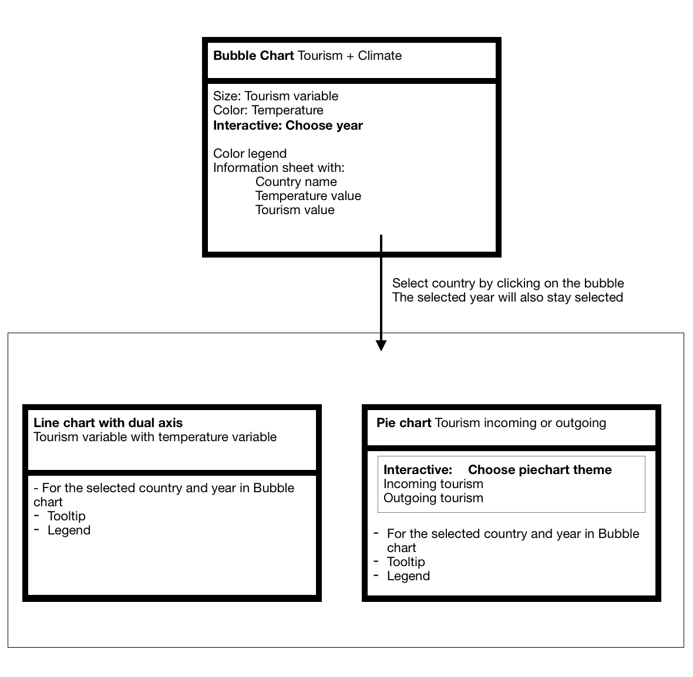

# Design Document
#### Sofie Löhr (11038926)

## Datasource:
##### Climate data from: 
+ [ecad](https://www.ecad.eu/dailydata/predefinedseries.php#)
	+ Daily mean temperature TG (Blended datasets)

##### Tourism data from:
+ [Eurostat](https://ec.europa.eu/eurostat/web/tourism/data/database)
	+ Arrivals at tourist accommodation establishments - monthly data (tour_occ_arm)
	+ Number of trips by country / world region of destination (tour_dem_ttw)	

### Process the data
First I need to process the input files from tourism and climate seperately. Then I have to combine the sets and then convert it to JSON for easy to use in javascript. This will all be done in python.

##### Process tourism input files
To process the tourism input files I have to add the country codes to the data, combine some variables and make the data easy to use.

##### Process climate input files
This data comes in different txt files per weather station by station ID (downloadable per temperature variable) so these have to be combined into one big file. This file will have (at least) the following variables:
+ Country
+ Country code
+ Weather station
+ Average temperature
+ Date

To combine these seperate files I have to load all the different weather station files and combine them per country by using the stations.txt file. Also it is very important to make the dictionaries as easy to use as possible (like the average tempereture for a specific year (bubble chart) and values per month (line chart)). To make the temperature values easy to use, they have to be made into month or year values and instead of per 0.1 degree celsius, I will transfrom them in degrees celsius with 1 decimal.

## Diagram of the technical components
The pages of the website will be like this.

In the bubble chart, the relationship between temperature and tourism will be visible. By hovering on a (country) bubble, the specifics of that country will become visible in a small infosheet. By clicking on the (country) bubble a (pop up) window will give specific information about that country in the selected year. This will be done by a dual axis linechart of the tourism variable per month together with the average temperature. To see the division of inbound, domestic and outbound tourism, a piechart can be chosen by a dropdown with as options:
+ Piechart of incoming tourism (same variable as the line graph) divided by country of residence: foreign or reporting (own) country.
+ Piechart of outgoing tourism (residents) by country of destination: own country (country of residence) and other countries (for example continents or other EU countries). This is another variable than in the linegraph.

Below you see the technical components of the visualization page.

#### Total design

## External components & D3 plugins
Overall I will need D3. The plugins i use are:
+ D3 tip (bubble chart, maybe pie and line chart)
+ D3 legend (bubble chart, piechart, maybe line chart)
+ Bootstrap (interactive elements, modal window)