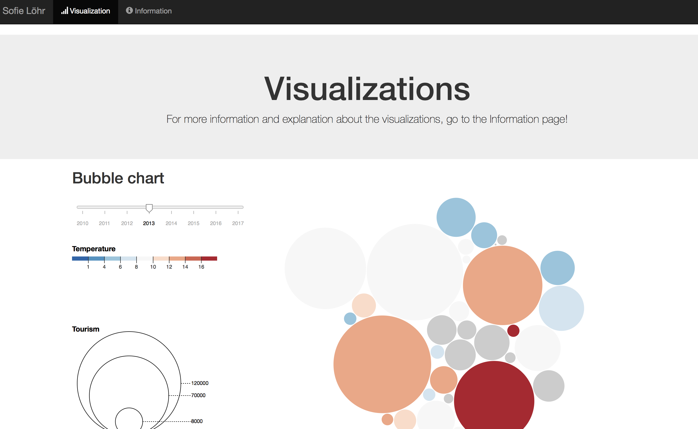
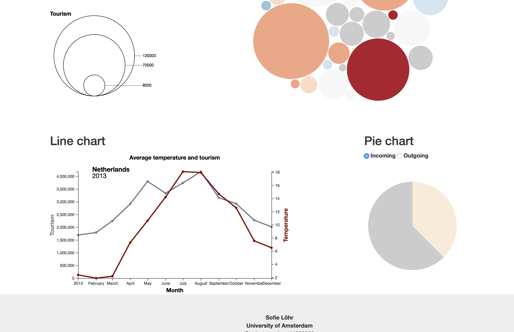
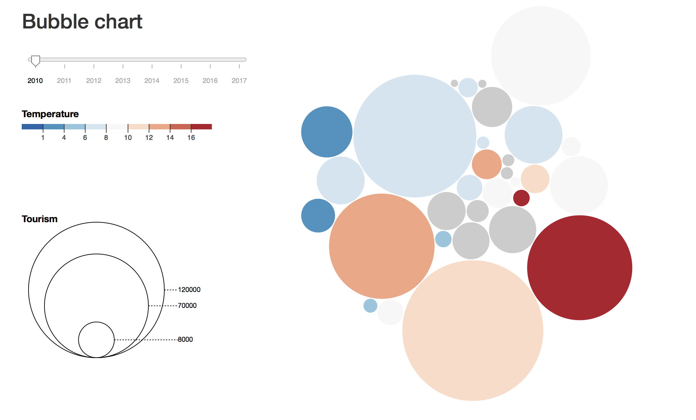
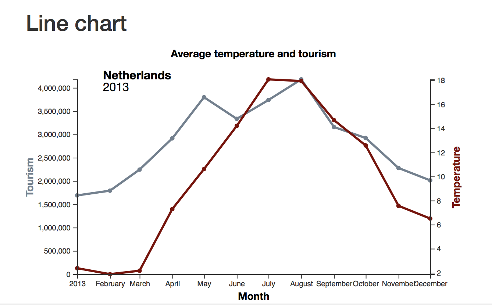
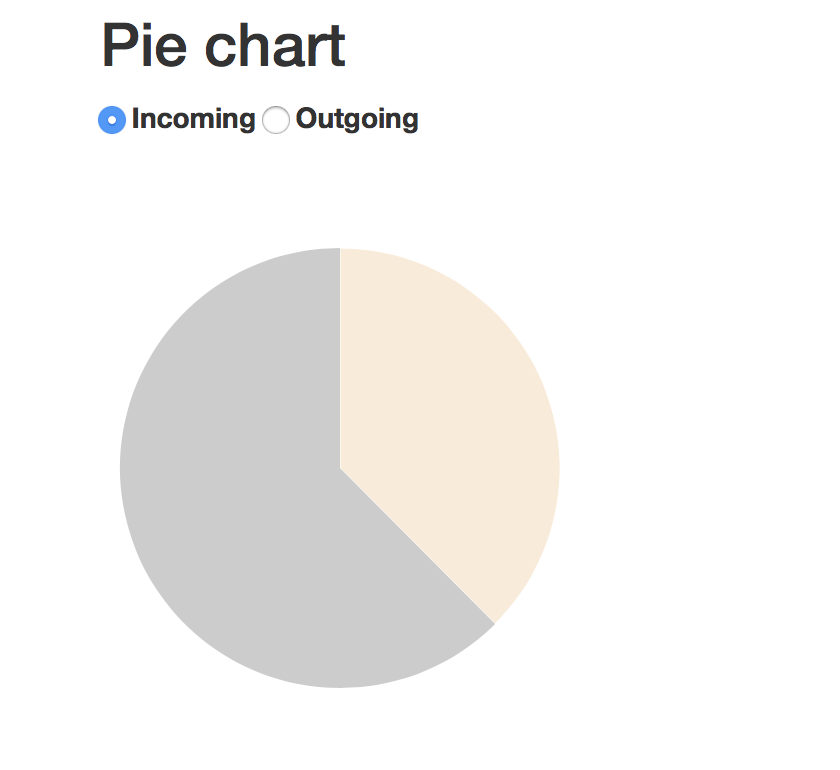
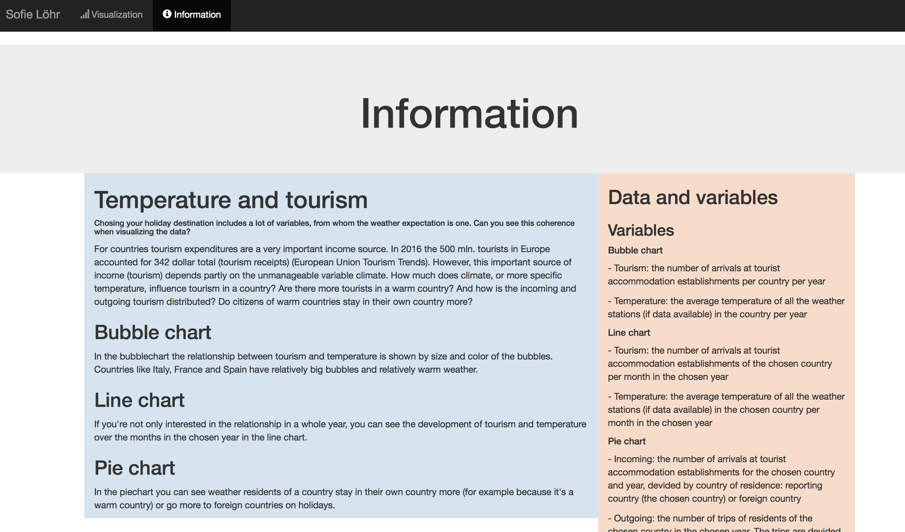

# Climate and tourism
Sofie Löhr (11038926)

### Link to my website

https://sofielohr.github.io/project/

### Link to video

https://youtu.be/qiesoWNGbNw

### Visualizations

 
 

The first visualization is a bubblechart. It's purpose is to show the relationship between the average temperature of a country and it's tourism. The tourism variable is the number of arrivals at tourist accommodation establisments. The color represents the temperature going from blue (colder) to red (warmer). The size represents the tourism, the bigger the circle, the higher the tourist arrivals. The default graph is data from 2010 and it can be set to every year from 2010 to 2017 by a timeslider. 

 

To show the relationship during the chosen year, a dual axis line chart is shown. The tourist arrivals and average temperatures are shown over the year. 

 

To show the preferences of the tourists, a pie chart is show for the chosen country and year. When the button "incoming" is clicked, the piechart shows distribution of the tourists arrivals by reporting country or foreign country. 

When the button "outgoing" is clicked, the piechart shows whether the residents of the country stay in their country or go to another country for their trip (domestic or outbound).

 

The information sheet contains information about the visualizations, data and used variables. 

 

### External code used
+ [Bubble chart](https://observablehq.com/@d3/bubble-chart)
+ [Update bubblechart](https://bl.ocks.org/HarryStevens/54d01f118bc8d1f2c4ccd98235f33848)
+ [D3 Bubble Chart](http://bl.ocks.org/phuonghuynh/54a2f97950feadb45b07)
+ [Dual axis line chart](https://bl.ocks.org/d3noob/814a2bcb3e7d8d8db74f36f77c8e6b7f)
+ [Bubblechart legend](https://www.d3-graph-gallery.com/graph/bubble_legend.html)
+ [Piechart update](https://bl.ocks.org/adamjanes/5e53cfa2ef3d3f05828020315a3ba18c/22619fa86de2045b6eeb4060e747c5076569ec47)

### Datasources
+ [ecad](https://www.ecad.eu/dailydata/predefinedseries.php#)
+ [Eurostat](https://ec.europa.eu/eurostat/web/tourism/data/database)

##### Country codes with country name
https://datahub.io/core/country-list#data

