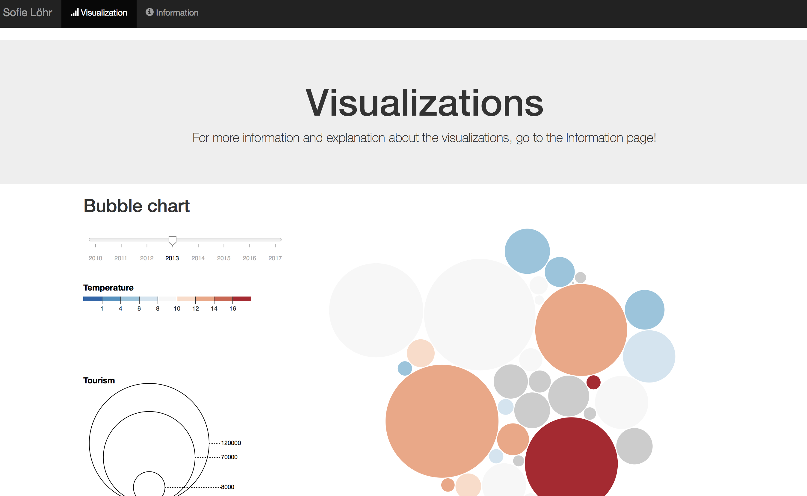

# Final Report
Sofie Löhr (11038926)

## Description
This website shows the relationship between climate (temperature) and tourism. In the bubblechart this relationship is shown by the size and colors of the bubbles. The size of the bubbles represents the number of tourists per country and the color represents the average temperature per country, both in the chosen year. In the slider you can chose a year. If you want to see this relationship during the chosen year for a country, you can click one of the bubbles and then the line chart shows the temperature and tourists over the year. The piechart also updates when a country is clicked. This piechart shows the origin of the incoming tourist (when 'incoming' is clicked): Foreign or Reporting country. When 'outgoing' is clicked, the trip destination of the chosen country's residents is shown: Domestic or Outbound. 

 
 

## Technical design
The website exsists of 2 pages (html): the index (visualization) page and the information page. The index.html imports all the javascript files to actually make the visualizations. 

The navigation and creation of the graphs is as follows: when the page is loaded, main.js runs. In this file the data for the graphs is processed to the right javascript format with functions process (bubblechart.js), line_data (linechart.js), piechart_data (piechart.js) and then the slider (bubblechart.js) is made. In the slider function, the default bubble chart (with it's color legend) is created. Then in main, the circle legend of the bubblechart and both the linechart and piechart are created. 

Updating the graph when changing the year in the slider is done with the function redraw (bubblechart.js). When a country bubble is clicked, the linechart and piechart are updated (from redraw) with update_line (linechart.js) and update_pie (piechart.js). Inside update_pie is the function interactive_pie. This function updates the piechart when the radio button input changes (incoming-outgoing). Note: when updating the piechart because of a country change, the piechart (and radio button) is set to incoming.

A more detailed description of all the functions is given in Components. 

#### Components
##### index.html and information.html
The index.html file contains all the javascript files and the external imports (like D3). The information file contains the info in html.

##### Python
Since processing my data was a bit complicated, I will shortly describe the steps I made in the files. 

###### process_tourism.py
This file loads the input file (tour_occ_arm_1_Data.csv) into a pandas dataframe. Then the functions process and process_pie delete unnecessary rows and columns and the data is formatted. The function can respectively be used for the bubble and line data or the pie data. For the bubble and pie data, the function year_data is used to make yearly data from the month data. Then it converts to json. 

###### piedata.py
This script only deleted unnecessary rows and columns and formats the data (tour_dem_ttw_1_Data) in the right way. This data is the 'outgoing' data for the piechart and is already yearly data. Last, it converts to json.

###### process_climate.py
This file loads and processes the temperature data. The data from Ecad comes in a folder with 4 types of txt files. First a file stations.txt with a table of all the weather stations (codes), the corresponding country code and some other variables. Then there are over 4000 files of all the daily average temperature of the different weather stations. The other two files elements.txt and sources.txt will not be used. 

The file loops over all the files, skipping elements.txt and sources.txt, processing the weather station files and loading the stations file. The individual weather station files are first formatted (also adding/deleting rows/columns) and then combined to the total data file. 

The total datafile is then processed as follows:
+ The file is merged with the stations dataframe so the country codes can be used.
+ Then the individual weather station data is combined per country.
+ The country names (from country_names.csv) are added.

##### Javascript

###### main.js

###### bubblechart.js

###### linechart.js

###### piechart.js

