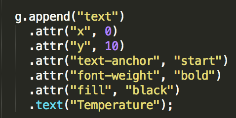

# Style guide

### Comments

Comments are used when the code itself is not explaining enough.
All comments are in English. 

### Indentation 

4 spaces are used as a tab. When adding elements (like .attr or .style) to an variable, this is done vertically. Example in the picture. 

 

### Naming
Variable names are being chosen logical, just like function names. 

### Gouping
After a function, 2 enters are being used. 

Select values from a Object using ".key".