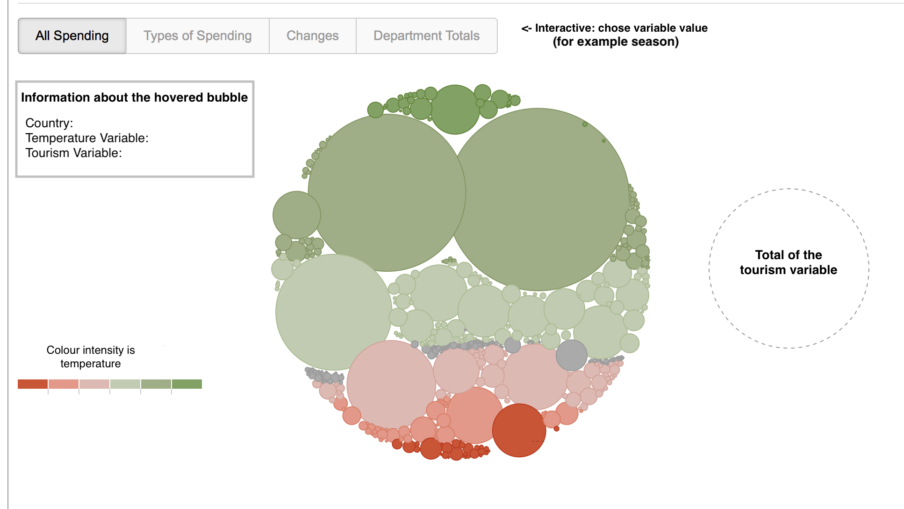

# Eindproject proposal
#### Sofie Löhr (11038926)
Chosing your holiday destination includes a lot of variables, from whom the weather expectation is one. Can you see this coherence when visualizing the data?

## Problem statement
As the climate around the world is changing and tourism and climate seem highly correlated, it is good to visualize the most important weather and tourism factors side by side to see if there is a connection. Determining the effect of climate change on tourism would be something for future work, but stating the fact that there is coherence could be a good start so that is what I will do.

## Solution
Since Europe has the most international tourists arrivals from all the continents in the world (European Union Tourism Trends), this is the area I will be focussing on. 

To visualize this relationship I will first show a bubble chart, with color intensity stating the temperature variable (for example average temperature) and size stating the tourism variable (for example international arrivals or number of trips). Additional information when hovered will show next to it. 

This bubble chart will be interactive by chosing the YEAR.

An additional (pop up) window when clicked on one of the (country) bubbles will have specific information about that country in the selected year. 
+ Circle diagram with tourism purpose/duration
+ Line chart of daily minimal and maximal temperature to show the climate over the year 

## Prerequisites

### Data Sources
##### Climate data from: 
+ [ecad](https://www.ecad.eu/dailydata/predefinedseries.php#)

##### Tourism data from:
+ [Eurostat](https://ec.europa.eu/eurostat/web/tourism/data/database)
+ [Kaggle](https://www.kaggle.com/ajaafer/tourism-expenditures-of-total-imports)
+ [Worldbank](https://data.worldbank.org/indicator/ST.INT.ARVL)

### External Components
+ [D3](https://d3js.org/)
+ [D3-tip](https://github.com/Caged/d3-tip)
+ [Atom](atom.io)
+ [Sublime Text 2](https://www.sublimetext.com/2)

### Hardest parts
+ Arranging and combining the data in the right way, since I have a lot of different sources
+ Bubble chart implementation (if I have time I will implement moving bubbles when clicked)
+ If time, instead of line chart for minimal and maximal temperature, I will implement a steamgraph

## Reverences
Bubble chart example:
+ [Four Ways to Slice Obama’s 2013 Budget Proposal](https://archive.nytimes.com/www.nytimes.com/interactive/2012/02/13/us/politics/2013-budget-proposal-graphic.html)
+ [D3 Bubble Chart](http://bl.ocks.org/phuonghuynh/54a2f97950feadb45b07)
+ [European Union Tourism Trends](https://www.e-unwto.org/doi/pdf/10.18111/9789284419470)